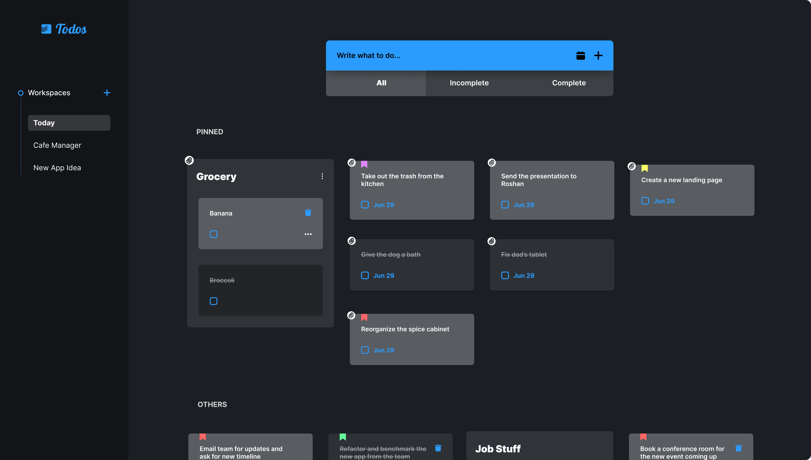

# Todos Management App (WIP)

This is a todos management app created for managing your day-to-day works as well as the professional work requirements.

This is the current UI Design



## Features

- Todos can be dragged and dropped in any order.
- Different workspace environments for different kind of todos.
- Group all the todos related to each other and name them.
- Pin todos or todo groups to the top of the workspace.
- Add deadlines to todos for when it is due completion.
- Add customizable labels to todos.
- Filter todos based on their complete status - All, Incomplete, Complete

## Contribute

Clone locally and in the projects directory you can run:

```
npm install
npm start
```

This will start the application in development mode.\
Open [http://localhost:3000](http://localhost:3000) to view it in the browser.

## Build

```
npm run build
```

This will builds the app for production to the `build` folder.

## License

This program is a free software and is licensed under the term of [GNU Affero General Public License Version 3 or later](https://www.gnu.org/licenses/agpl-3.0.html). For full details about the license, please check the `LICENSE.md` file.
